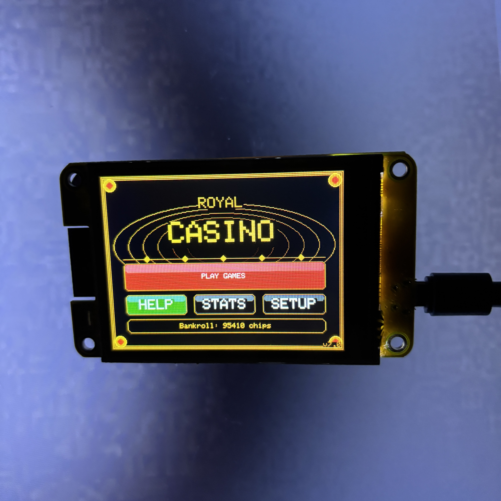
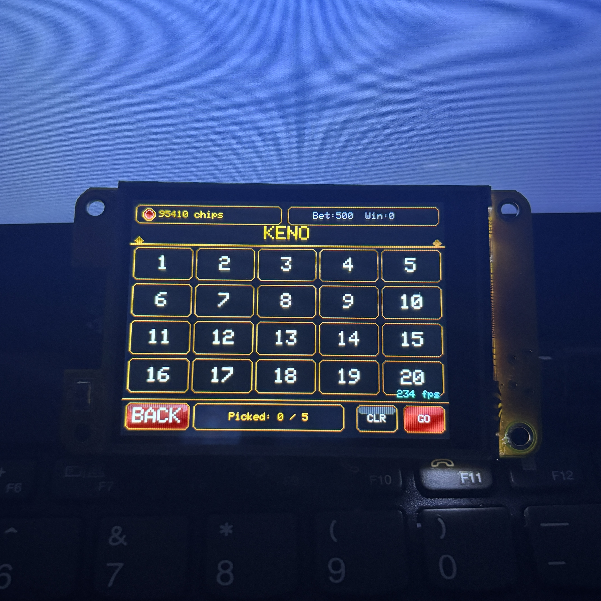
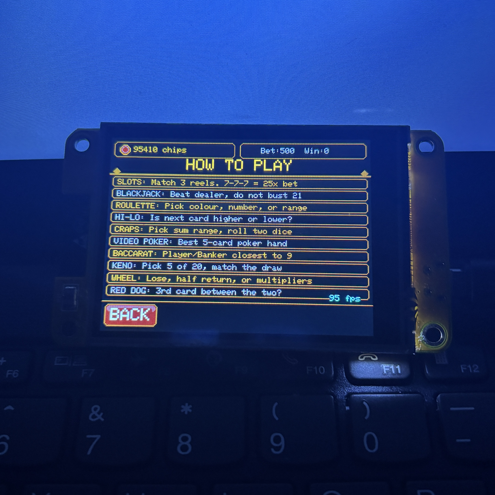
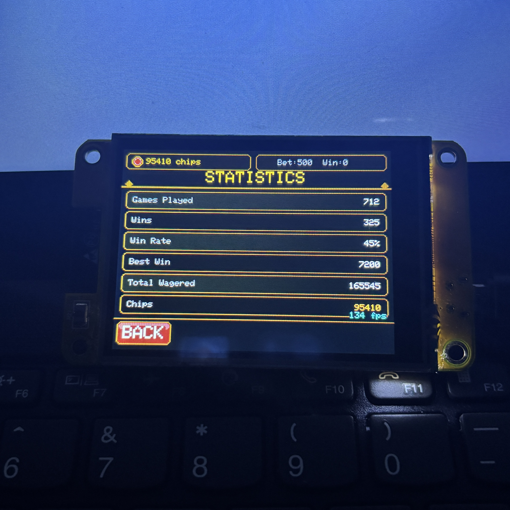

<div align="center">

# :trollface: ROYAL CASINO v7.0 :trollface:

### Premium ESP32 CYD Casino Firmware for the Cheap Yellow Display

<p>
  <strong>ESP32-2432S028</strong> • <strong>320×240 TFT</strong> • <strong>Touchscreen UI</strong> • <strong>Sound FX</strong> • <strong>Persistent Save Data</strong>
</p>

<p align="center">
  ⭐ If you like this project, consider giving it a star!
</p>

<p>
  
</p>

<p>
  
  
  
  
  
  
</p>

<p>
  
  
  
  
</p>

<br>

**ROYAL CASINO v7.0** turns the ESP32 Cheap Yellow Display into a polished handheld casino system with animated games, touchscreen controls, sound effects, persistent bankroll tracking, statistics, debug tools, and an admin chip refill system.

</div>

> [!CAUTION]
> This project is source-available, not open-source.  
> Commercial use of this code in its original or slightly modified form is strictly prohibited.

---

##  Highlights

-  **16+ playable casino games** across three game menus
-  **Pixel-exact 320×240 layout** designed specifically for the ESP32 CYD
-  **Anti-flicker rendering** using dirty-screen redraw logic
-  **Touchscreen-first controls** with debounce and coordinate calibration
-  **Non-blocking sound engine** for clicks, wins, losses, dice, spins, jackpots, and chimes
-  **Persistent save system** using ESP32 `Preferences`
-  **Statistics screen** for games played, wins, win rate, biggest win, total wagered, and chips
-  **Admin PIN flow** for controlled chip refills
-  **Debug mode** with FPS, heap, screen ID, bet, credits, and serial dump
-  **Premium casino UI** with gold trims, gradients, cards, dice, chips, buttons, and animated elements

---

##  Table of Contents

- [Screenshots](#-screenshots)
- [Supported Hardware](#-supported-hardware)
- [Game List](#-game-list)
- [Controls](#-controls)
- [Installation](#-installation)
- [Arduino IDE Setup](#-arduino-ide-setup)
- [PlatformIO Setup](#-platformio-setup)
- [Pin Configuration](#-pin-configuration)
- [Touch Calibration](#-touch-calibration)
- [Save Data](#-save-data)
- [Admin & Debug Features](#-admin--debug-features)
- [Troubleshooting](#-troubleshooting)
- [Roadmap](#-roadmap)
- [Contributing](#-contributing)
- [License](#-license)

---

##  Screenshots

> Replace these images with your real captures from the device.

<div align="center">

<table>
<tr>
<td align="center"><br><b>Main Menu</b></td>
<td align="center"><br><b>Slots</b></td>
<td align="center"><br><b>Keno</b></td>
</tr>
<tr>
<td align="center"><br><b>Help</b></td>
<td align="center"><br><b>Stats</b></td>
<td align="center"><br><b>Settings</b></td>
</tr>
</table>

</div>

---

##  Supported Hardware
> [!CAUTION]
> This firmware is built for the **ESP32-2432S028**, commonly known as the **Cheap Yellow Display** or **CYD**.

| Part | Requirement |
| --- | --- |
| Board | ESP32-2432S028 / CYD |
| Display | 2.8" ILI9341 TFT |
| Resolution | 320×240 |
| Touch | XPT2046 resistive touch controller |
| Audio | Optional passive buzzer on GPIO 26 |
| Storage | ESP32 NVS through `Preferences` |
| USB | Micro-USB cable capable of data transfer |

---

##  Game List

### Main Game Menu

| Game | Type | What it does |
| --- | --- | --- |
| **Slots** | Reel game | Pull the lever, spin 3 reels, win on pairs/triples/7s |
| **Blackjack** | Card game | Hit, stand, double, beat the dealer without busting 21 |
| **Roulette** | Wheel game | Bet red/black, low/high, odd/even, zero, or chosen number |
| **Hi-Lo** | Card game | Guess whether the next card is higher or lower |
| **Craps** | Dice game | Pick dice outcome ranges and roll two dice |

### Card & Number Games

| Game | Type | What it does |
| --- | --- | --- |
| **Video Poker** | Card game | Deal, hold cards, draw, and score poker hands |
| **Baccarat** | Card game | Bet player, banker, or tie; closest to 9 wins |
| **Keno** | Number game | Pick 5 numbers from 20 and match the draw |
| **Sic Bo** | Dice game | Bet small, triple, or big on three dice |
| **3-Card Poker** | Card game | Deal three cards and play/fold against the hand result |

### More Games

| Game | Type | What it does |
| --- | --- | --- |
| **Red Dog** | Card game | Draw a third card and try to land between two cards |
| **Wheel** | Wheel game | Spin for lose, half-back, or multiplier results |
| **War** | Card game | Player and dealer draw; highest card wins |
| **Lucky 7** | Dice game | Bet under 7, exactly 7, or over 7 |
| **Scratch** | Scratch-card game | Reveal a 3×3 scratch board and check for wins |
| **Plinko** | Drop game | Drop a puck through pegs into payout slots |

### Included Experimental Screens

The code also includes screen handlers for:

- Caribbean Stud
- Let It Ride
- Double Down
- Mini Baccarat
- High Card

These are present in the firmware switch logic and can be wired into the menu if you want to expose even more games.

---

##  Controls

ROYAL CASINO is designed around a simple touchscreen layout that stays consistent on every screen.

```text
┌────────────────────────────────────────┐
│ Header: chips, bet, title       0..47  │
├────────────────────────────────────────┤
│ Game area                       48..203│
├────────────────────────────────────────┤
│ Footer: back + action buttons   204..239│
└────────────────────────────────────────┘
```

| Area | Coordinates | Purpose |
| --- | --- | --- |
| Header | `y = 0..47` | Title, credits, bet, last win |
| Game area | `y = 48..203` | Cards, reels, dice, wheel, game content |
| Back button | `x=4, y=208, w=62, h=26` | Return to menu/group screen |
| Action area | `x=70, y=208, w=246, h=26` | Main action buttons and status |

---

## 📥 Download

### Prebuilt Firmware (.bin)

Download the latest firmware:

- 👉 **ROYAL_CASINO_v7.0.bin**

Flash it using `esptool.py` (see instructions below).

> [!NOTE]
> This is the easiest way to run the project without compiling the code.

##  Installation

### Flash a prebuilt binary

If you have a compiled `.bin` file, flash it with `esptool.py`:

```bash
pip install esptool

esptool.py --chip esp32 \
  --port COMx \
  --baud 921600 \
  write_flash 0x0 ROYAL_CASINO_v7.0.bin
```

Replace `COMx` with your actual serial port:

| OS | Example port |
| --- | --- |
| Windows | `COM3`, `COM4`, `COM5` |
| macOS | `/dev/cu.usbserial-*` |
| Linux | `/dev/ttyUSB0` |

---

##  Arduino IDE Setup

1. Install **Arduino IDE 2.x**.
2. Add the ESP32 board package URL:

```text
https://raw.githubusercontent.com/espressif/arduino-esp32/gh-pages/package_esp32_index.json
```

3. Install the **ESP32 by Espressif Systems** board package.
4. Select a compatible ESP32 board profile, commonly:

```text
ESP32 Dev Module
```

5. Install required libraries:

| Library | Purpose |
| --- | --- |
| `TFT_eSPI` | ILI9341 TFT display rendering |
| `XPT2046_Touchscreen` | Resistive touch input |
| `SPI` | SPI bus communication |
| `Preferences` | Persistent NVS storage |

6. Configure `TFT_eSPI` for your CYD board.
7. Open the `.ino` sketch.
8. Upload to your ESP32 CYD.

---

##  PlatformIO Setup

If you prefer PlatformIO, use a setup similar to this:

```ini
[env:esp32-cyd]
platform = espressif32
board = esp32dev
framework = arduino
monitor_speed = 115200
upload_speed = 921600

lib_deps =
  bodmer/TFT_eSPI
  paulstoffregen/XPT2046_Touchscreen

build_flags =
  -D USER_SETUP_LOADED=1
```

Then run:

```bash
pio run
pio run --target upload
pio device monitor
```

---

##  Pin Configuration

These values come directly from the firmware:

```cpp
#define PIN_TFT_BL      21
#define PIN_TOUCH_CS    33
#define PIN_TOUCH_IRQ   -1
#define PIN_TOUCH_MOSI  32
#define PIN_TOUCH_MISO  39
#define PIN_TOUCH_CLK   25
#define PIN_BUZZER      26
```

| Signal | GPIO | Notes |
| --- | ---: | --- |
| TFT backlight | 21 | Enabled high during setup |
| Touch CS | 33 | XPT2046 chip select |
| Touch IRQ | -1 | Disabled by default |
| Touch MOSI | 32 | Touch SPI MOSI |
| Touch MISO | 39 | Touch SPI MISO |
| Touch CLK | 25 | Touch SPI clock |
| Buzzer | 26 | Used with `tone()` / `noTone()` |

---

##  Touch Calibration

Default touch calibration values:

```cpp
#define TS_RAW_X_MIN     200
#define TS_RAW_X_MAX    3700
#define TS_RAW_Y_MIN     240
#define TS_RAW_Y_MAX    3800
#define TOUCH_SWAP_AXES   0
#define TOUCH_FLIP_X      0
#define TOUCH_FLIP_Y      0
#define TOUCH_OFFSET_X    0
#define TOUCH_OFFSET_Y    0
#define TOUCH_DEBOUNCE  160
```

If touches are mirrored, rotated, or offset, adjust:

| Setting | Use when |
| --- | --- |
| `TOUCH_SWAP_AXES` | X/Y are swapped |
| `TOUCH_FLIP_X` | Horizontal direction is reversed |
| `TOUCH_FLIP_Y` | Vertical direction is reversed |
| `TOUCH_OFFSET_X` | Touches are shifted left/right |
| `TOUCH_OFFSET_Y` | Touches are shifted up/down |
| `TOUCH_DEBOUNCE` | Touches double-trigger or feel too slow |

---

##  Save Data

ROYAL CASINO uses ESP32 `Preferences` to save player progress and settings.

| Key | Data | Description |
| --- | --- | --- |
| `cr` | `int` | Current credits |
| `bt` | `ushort` | Default bet amount |
| `pl` | `uint` | Games played |
| `wn` | `uint` | Games won |
| `bw` | `uint` | Biggest win |
| `tw` | `uint` | Total wagered |
| `snd` | `bool` | Sound enabled/disabled |
| `dbg` | `bool` | Debug mode enabled/disabled |

Default values:

| Setting | Default |
| --- | ---: |
| Credits | `500` |
| Bet | `10` |
| Minimum bet step | `5` |
| Maximum bet | `500` |
| Sound | `ON` |
| Debug | `OFF` |

---

##  Admin & Debug Features

### Admin Chip Refill

The settings screen includes an **ADD CHIPS** flow protected by a PIN keypad.

| Feature | Value |
| --- | --- |
| Default admin PIN | `7777` |
| Reward on success | `+1000 chips` |
| Wrong PIN behavior | Error sound + status message |

> Change `ADMIN_PASS` if you want your own code.

```cpp
#define ADMIN_PASS "7777"
```

### Debug Mode

Debug mode shows internal firmware state and can print a serial dump.

Displayed debug values include:

- Credits
- Bet
- Current screen ID
- FPS
- Games played
- Free heap

Serial dump format:

```text
[DUMP] Cr=<credits> Bt=<bet> Pl=<played> Wn=<wins>
```

---


##  Sound Effects

The sound engine is non-blocking, meaning animations and touch input continue while tones play.

| Effect | Used for |
| --- | --- |
| Click | Button presses and navigation |
| Win | Standard winning result |
| Lose | Losing result |
| Spin | Slot and wheel-style motion |
| Jackpot | Large wins |
| Chime | Startup and admin success |
| Error | Invalid action or wrong PIN |
| Dice | Dice rolling |

---

##  Why This Firmware Feels Smooth

The sketch avoids full-screen redraws unless needed:

```cpp
if (dirty) {
  dirty = false;
  switch (screen) {
    case SCR_MENU: drawMenu(); break;
    case SCR_SLOTS: drawSlots(); break;
    // ...
  }
}
```

Animations update independently:

```cpp
updateSound();
updateAnimations();
```

This keeps the UI responsive on a small ESP32 display and helps reduce flicker.

---

##  Troubleshooting

### Upload fails

- Use a real data USB cable, not a charge-only cable.
- Hold the BOOT button while upload starts.
- Try a slower upload speed like `115200`.
- Install the correct USB serial driver for your board.

### Screen is blank

- Confirm the board is an ESP32 CYD / ESP32-2432S028.
- Check `TFT_eSPI` setup for ILI9341.
- Make sure backlight pin GPIO 21 is enabled.
- Try a different TFT rotation if your board variant differs.

### Touch is wrong or inverted

Adjust these values:

```cpp
TOUCH_SWAP_AXES
TOUCH_FLIP_X
TOUCH_FLIP_Y
TOUCH_OFFSET_X
TOUCH_OFFSET_Y
```

### Sound does not work

- Connect the buzzer signal to GPIO 26.
- Connect the buzzer ground to GND.
- Turn sound on in settings.
- Test with another passive buzzer.

### Credits or settings do not persist

- Confirm `prefs.begin()` is called in setup.
- Avoid power loss during save operations.
- Clear NVS if old data is corrupt.

### Touch double-clicks

Increase:

```cpp
#define TOUCH_DEBOUNCE 160
```

---

##  Contributing

Contributions are welcome.

Good ideas for pull requests:

- New casino games
- Better payout balancing
- Touch calibration improvements
- UI polish
- Bug fixes for CYD board variants
- Screenshots and documentation
- PlatformIO configuration improvements

Suggested contribution flow:

```bash
git checkout -b feature/your-feature-name
git commit -m "Add your feature"
git push origin feature/your-feature-name
```

Then open a pull request.

---

##  Disclaimer

This project is for entertainment, learning, and hobby electronics only. It does not use real money and should not be used for gambling or commercial casino systems.

---

## License

Copyright (c) 2026 Pentalini

This project is source-available software.

You are allowed to:
- Use this software for personal and educational purposes
- Study and modify the source code
- Create your own projects inspired by this code
- Use parts of the code in new and original projects

You are NOT allowed to:
- Sell this software in its original or slightly modified form
- Redistribute this project as your own
- Redistribute this project outside of this repository without permission

If you create a significantly modified and original project based on this code,
you may distribute or sell it, but it must not be a direct copy or minor variation.

The original project "ROYAL CASINO" remains the property of the author.
---

<div align="center">

### Built for makers who want a tiny ESP32 board to feel like a real arcade machine.

## ⭐ Support

If you like this project:

⭐ Star the repository  
🍴 Fork it  
📢 Share it  

It helps the project grow!

<p>
  <b>ROYAL CASINO v7.0</b><br>
  ESP32 CYD • Touch UI • Casino Games • Sound • Save System
</p>

</div>
If you want to use this project commercially, contact me.
